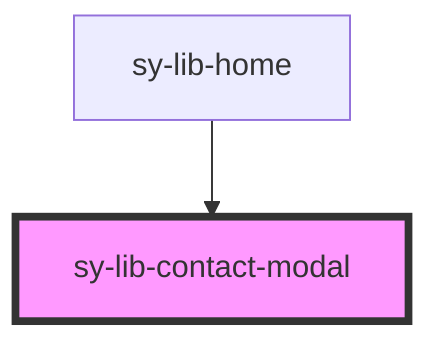

# sy-lib-contact-modal

<!-- Auto Generated Below -->

## Properties

| Property         | Attribute         | Description                              | Type      | Default |
| ---------------- | ----------------- | ---------------------------------------- | --------- | ------- |
| `defaultSubject` | `default-subject` | Assunto pré-preenchido ao abrir o modal. | `string`  | `''`    |
| `open`           | `open`            | Controla a abertura do modal.            | `boolean` | `false` |

## Events

| Event                    | Description                                                           | Type                |
| ------------------------ | --------------------------------------------------------------------- | ------------------- |
| `syLibContactModalClose` | Disparado quando o usuário fecha o modal (botão, Esc ou clique fora). | `CustomEvent<void>` |

## Dependencies

### Used by

 - [sy-lib-home](../home)

### Graph

----------------------------------------------

*Built with [StencilJS](https://stenciljs.com/)*
